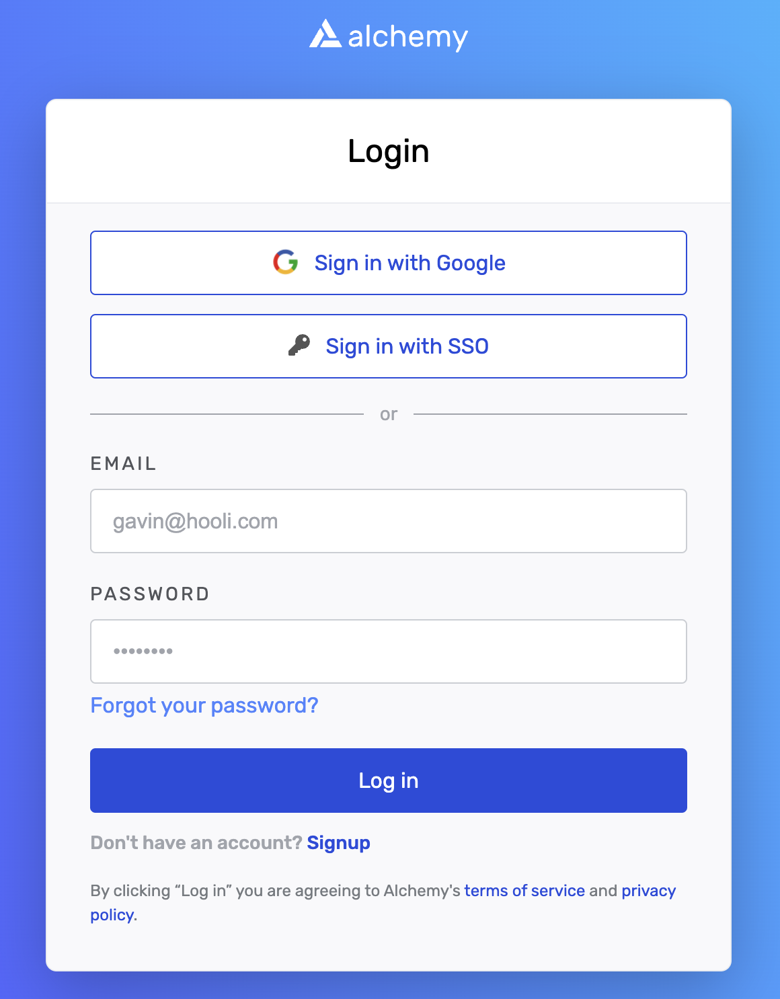
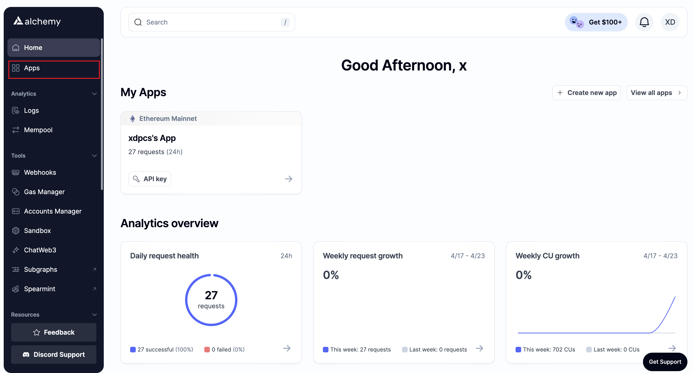
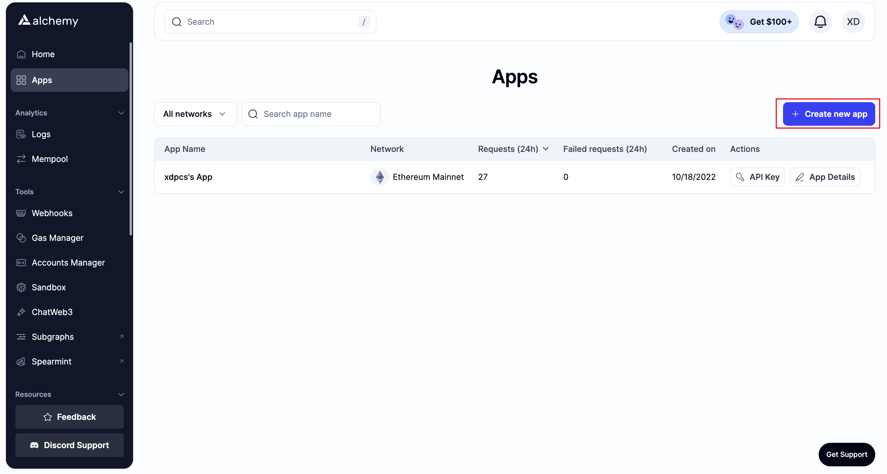
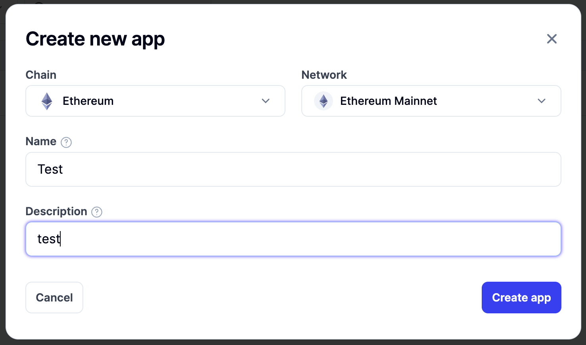
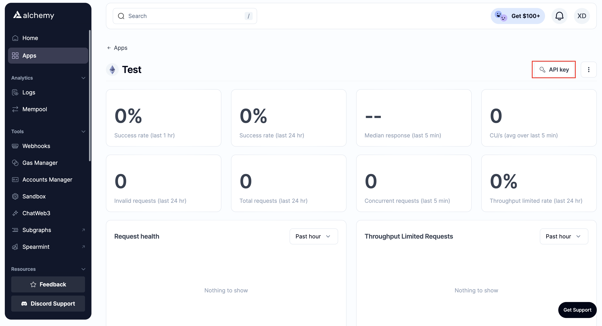

# 001-Alchemy

## 背景

通过学习`Solidity`，然后输出文章检验自己的学习成果[Github仓库](https://github.com/XdpCs/Solidity-learning)

欢迎大家关注我的[X](https://twitter.com/CsXdp)

## 什么是Alchemy

Alchemy提供了强大的 API、SDK 和工具，轻松构建和扩展你的 Web3 应用，现在提供了以太坊、Polygon、Optimism、Arbitrum、Solana、Base、Starknet
和 Astar的支持。

## 为什么使用Alchemy

如果我们需要和区块链交互，我们需要一个节点，但是我们不可能每个人都去搭建一个节点，所以我们可以使用Alchemy提供的节点，这样我们就可以和区块链进行交互了。
Alchemy会提供免费的节点，但是有一些限制，如果我们需要更多的功能，我们可以选择付费的节点。

## 申请Alchemy API Key

### 注册登录

我们通过[Alchemy](https://auth.alchemy.com/)进行注册登录

### 申请API Key

要使用 Alchemy 的产品，需要一个 API 密钥来验证您的请求

我们通过[仪表盘](https://dashboard.alchemy.com/)创建API Key

1. 输入[仪表盘](https://dashboard.alchemy.com/)链接，点击`Apps`

   

2. 点击 `Create new app` 按钮

   

3. 填写新应用程序的详细信息，包括为其指定网络、名称和说明，然后单击“Create app”按钮。

    

4. 点击`API Key`，会展示`Key`的信息

    
